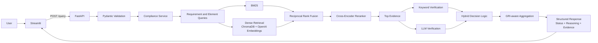
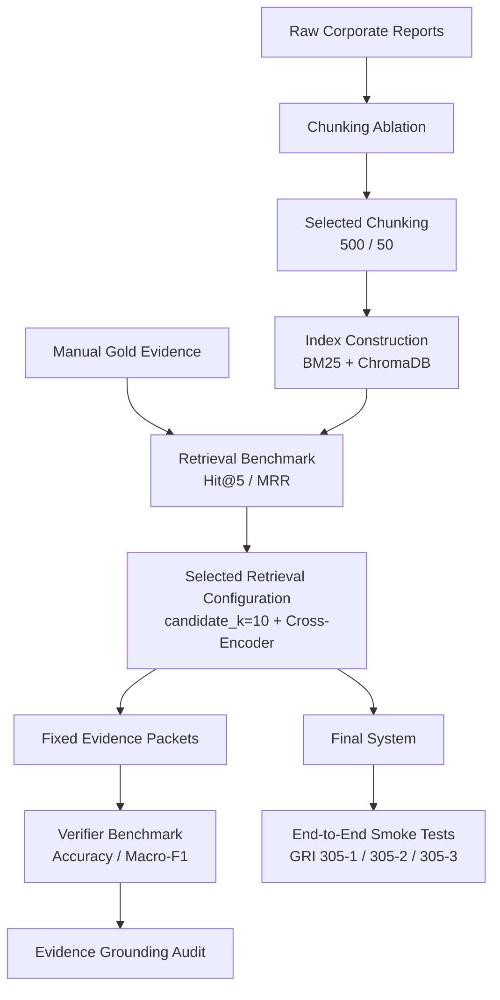

# ESG Report Compliance Checker

**Evidence-grounded ESG disclosure verification using hybrid retrieval, cross-encoder reranking, and LLM-assisted verification.**

An applied NLP system for evaluating corporate sustainability reports against **GRI 305 emissions disclosure requirements**.

The system retrieves relevant passages from ESG reports, evaluates individual disclosure elements as `covered`, `partial`, or `missing`, and returns structured decisions with page-level supporting evidence.

---

## Highlights

- Hybrid dense + BM25 retrieval with Reciprocal Rank Fusion
- Multilingual cross-encoder reranking
- Element-specific English/Korean retrieval queries
- Evidence-grounded LLM verification with explicit disclosure rules
- Three-way classification: `covered`, `partial`, `missing`
- Support for GRI 305-1, 305-2, and 305-3
- Retrieval, chunking, reranker-depth, and verifier evaluation
- Separation of retrieval quality from verifier quality
- FastAPI backend with typed Pydantic contracts
- Decoupled Streamlit frontend
- Docker-based runtime
- **22 automated API, service, and system-regression tests**

---

## System Architecture



The retrieval and verification components are deliberately separated so that retrieval failures, evidence-quality problems, and classification errors can be analysed independently.

---

## Evaluation and Validation Workflow

A central design choice in this project is to **evaluate retrieval and verification separately before exercising the complete system**.



This prevents three different questions from being collapsed into a single score:

1. **Did retrieval find the relevant evidence?**
2. **Given fixed evidence, did the verifier classify it correctly?**
3. **Does the complete system execute coherently across supported requirements?**

---

## Final System Configuration

The final retrieval configuration was selected through controlled ablations rather than chosen heuristically.

- **Chunking:** 500-token target / 50-token overlap
- **Indexed report chunks:** 7,703
- **Candidate depth:** `candidate_k=10`
- **Candidate generation:** BM25 + dense retrieval + Reciprocal Rank Fusion
- **Requirement-level retrieval:** hybrid retrieval followed by cross-encoder reranking
- **Element retrieval:** element-specific multilingual queries with deduplication
- **Final evidence:** Top-5 reranked chunks
- **Dense embeddings:** `text-embedding-3-small`
- **Cross-encoder:** `cross-encoder/mmarco-mMiniLMv2-L12-H384-v1`

Generated ChromaDB stores are intentionally excluded from Git because they are reproducible build artifacts.

---

## GRI Coverage

The current structured requirement schema supports three GRI 305 disclosures.

### GRI 305-1 — Direct (Scope 1) GHG emissions

Seven disclosure elements covering:

- gross Scope 1 emissions
- gases included
- biogenic CO2
- base-year information
- emission factors / GWP sources
- consolidation approach
- standards and methodologies

### GRI 305-2 — Energy indirect (Scope 2) GHG emissions

Seven disclosure elements covering:

- location-based Scope 2 emissions
- market-based Scope 2 emissions, where applicable
- gases included, where available
- base-year information, where applicable
- emission factors / GWP sources
- consolidation approach
- standards, methodologies, assumptions, and calculation tools

### GRI 305-3 — Other indirect (Scope 3) GHG emissions

Seven disclosure elements covering:

- gross Scope 3 emissions
- gases included, where available
- biogenic CO2 reported separately
- Scope 3 categories and activities
- base-year information, where applicable
- emission factors / GWP sources
- standards, methodologies, assumptions, and calculation tools

> The final `covered / partial / missing` requirement-level decision is a **project-specific aggregation policy** built on top of the disclosure elements. It should not be interpreted as an official GRI compliance determination.

---

## Evaluation

Evaluation is reported at three distinct levels:

1. **Retrieval benchmark**
2. **Fixed-evidence verifier benchmark**
3. **End-to-end smoke testing**

Metrics from one layer are not presented as performance estimates for another.

### 1. Retrieval Benchmark

The retrieval benchmark contains **27 manually reviewed GRI 305-1 evidence queries across 11 corporate reports**.

Gold evidence was manually annotated and kept separate from retrieval predictions.

Because this benchmark is relatively small, the reported retrieval metrics should be interpreted as **small-sample estimates rather than population-level performance**, and may have non-trivial variance across a broader report set.

#### Chunking Ablation

All chunking configurations were constructed from the same source pages using deterministic preprocessing.

| Chunk target / overlap | Chunks | Hit@5 | MRR |
|---|---:|---:|---:|
| 250 / 25 | 14,249 | 0.815 | 0.698 |
| **500 / 50** | **7,703** | **0.963** | **0.779** |
| 750 / 75 | 5,494 | 0.852 | 0.665 |
| 1000 / 100 | 4,434 | 0.852 | 0.639 |

The **500 / 50** configuration was selected for the final system.

Gold-evidence integrity checks confirmed that this configuration preserved sufficient single-chunk evidence for all benchmark queries.

#### Reranker Candidate-Depth Ablation

With chunking fixed at 500 / 50:

| Candidate depth | Hybrid Hit@5 | Hybrid MRR | + Reranker Hit@5 | + Reranker MRR | Approx. E2E latency |
|---:|---:|---:|---:|---:|---:|
| **10** | 0.926 | 0.636 | **0.963** | **0.798** | **~1.0 s** |
| 20 | 0.926 | 0.649 | 0.963 | 0.779 | ~2.0 s |
| 40 | 0.926 | 0.679 | 0.926 | 0.772 | ~3.4 s |

`candidate_k=10` was selected because it matched the best Hit@5, produced the highest reranked MRR, and required substantially less retrieval/reranking time than deeper candidate pools.

#### Selected Retrieval Result

The final retrieval configuration achieved:

- **Hit@5: 0.963**
- **MRR: 0.798**
- **26 / 27 queries** with at least one gold evidence chunk in the Top-5

These metrics evaluate **retrieval only**. They are not end-to-end compliance-classification accuracy.

### 2. Fixed-Evidence LLM Verifier Benchmark

The verifier was evaluated separately from retrieval using **39 frozen evidence packets**.

Evidence packets were constructed from retrieved passages, manually reviewed, and frozen before verifier predictions were generated. This design reduces the risk of attributing retrieval failures to the verifier itself.

#### Label Distribution

- `covered`: 28
- `partial`: 4
- `missing`: 7

#### Classification Results

| Metric | Result |
|---|---:|
| Accuracy | **84.6%** |
| Macro-F1 | **0.730** |
| False-covered predictions | **0** |
| Missing → covered errors | **0** |

Per-class performance:

| Class | Precision | Recall | F1 | N |
|---|---:|---:|---:|---:|
| covered | 1.000 | 0.857 | 0.923 | 28 |
| partial | 0.400 | 0.500 | **0.444** | 4 |
| missing | 0.700 | 1.000 | 0.824 | 7 |

The weakest class was **`partial` (F1 = 0.444)**. However, this estimate is based on only four examples and is therefore highly unstable; more labelled borderline cases are required before drawing strong conclusions about partial-disclosure performance.

Within this benchmark, errors tended to be conservative: the verifier produced **no false-covered predictions** and no `missing → covered` errors.

#### Evidence Grounding

For correctly classified non-missing predictions:

- **26 / 26** contained at least one human-annotated supporting evidence chunk
- grounding overlap: **100%**

Predicted `missing` elements return an empty selected-evidence list.

> **84.6% accuracy refers only to the verifier operating on frozen evidence packets.** It is not an accuracy estimate for the complete retrieval + verification system.

### 3. End-to-End Smoke Testing

GRI 305-2 and GRI 305-3 were exercised using the final system across multiple corporate reports.

The smoke set contains:

- **6 report–requirement runs**
- **42 element-level verification checks**
- **0 execution failures**

The runs include examples from Schneider Electric, IBK Bank, KEPCO, and Heathrow Airport.

Manual inspection during smoke testing identified an entity-aggregation false positive: subsidiary-level Scope 3 values were initially capable of being interpreted as a reporting-entity gross total.

The verifier rules were subsequently tightened so that subsidiary, business-unit, or site-level values cannot satisfy a reporting-entity gross emissions element unless the report explicitly presents an appropriate aggregate.

> This is an **execution and qualitative smoke test, not an accuracy benchmark**.
> A fresh human-labelled benchmark for the full seven-element GRI 305-2 and GRI 305-3 schemas has not yet been constructed.

---

## Verification Logic

Each disclosure element receives one of three labels:

- **covered** — evidence sufficiently supports the disclosure element
- **partial** — relevant evidence exists, but support is incomplete or ambiguous
- **missing** — sufficient supporting evidence was not identified

This three-way design avoids forcing borderline ESG disclosures into binary decisions.

### Evidence Grounding

Non-missing decisions can return:

- source chunk ID
- report excerpt
- PDF page number
- verifier reasoning
- confidence
- verification method

The verifier validates model-selected evidence indices before mapping them back to source chunks.

Invalid, duplicated, non-integer, or out-of-range evidence references are discarded.

`missing` decisions return an empty selected-evidence list.

### Conditional Disclosures

Elements marked *if applicable* or *if available* are handled separately from unconditional elements.

Under the project's aggregation policy, a missing conditional element alone does not automatically prevent an overall `covered` result.

### Entity-Level Guarding

For gross Scope 2 and Scope 3 emissions, evidence must correspond to the reporting entity.

Subsidiary, site, or business-unit values are not independently summed by the verifier unless the report itself explicitly presents an aggregate appropriate to the reporting entity.

---

## API

### `GET /health`

```json
{
  "status": "healthy"
}
```

### `POST /query`

Example request:

```json
{
  "company_id": "Schneider",
  "standard": "gri_305",
  "requirement_id": "305-1",
  "verification_mode": "hybrid",
  "n_results": 10
}
```

Supported verification modes:

- `hybrid`
- `llm`
- `keyword`

Interactive Swagger documentation:

```text
http://localhost:8000/docs
```

OpenAPI schema:

```text
http://localhost:8000/openapi.json
```

### Error Handling

| Status | Meaning |
|---:|---|
| 200 | Compliance check completed |
| 400 | Request could not be processed |
| 404 | Company, requirement, or evidence not found |
| 422 | Request validation failed |
| 503 | External dependency unavailable |
| 500 | Unexpected server error |

---

## Automated Tests

The automated suite currently contains **22 tests** across three layers.

### API Tests

Coverage includes:

- health endpoint
- successful mocked compliance response
- blank company validation
- invalid verification mode
- retrieval-result limits
- company/evidence not found
- unknown requirements
- external-service timeout handling

### Service-Layer Tests

Coverage includes:

- valid checker result
- company-not-found conversion
- key-error conversion
- timeout conversion
- connection-error conversion

### System Regression Tests

Regression tests protect behaviours identified during system review, including:

- GRI 305-1 element-to-slot mapping
- conditional GRI 305-2 aggregation
- missing mandatory GRI 305-2 elements
- missing gross Scope 3 emissions
- Scope 2 / Scope 3 emission-factor query routing
- removal of hard-coded base years
- selected `500_50` corpus paths
- `candidate_k=10`
- hybrid-rerank requirement retrieval
- final Top-5 evidence configuration

Run:

```bash
pytest -q
```

Current result:

```text
22 passed
```

Expensive dependencies are mocked where appropriate so API and unit tests do not make unnecessary LLM or retrieval calls.

---

## Tech Stack

| Layer | Technology |
|---|---|
| Language | Python |
| API | FastAPI |
| Validation | Pydantic |
| Frontend | Streamlit |
| PDF extraction | PyMuPDF |
| Dense embeddings | OpenAI `text-embedding-3-small` |
| Vector store | ChromaDB |
| Lexical retrieval | BM25 (`rank-bm25`) |
| Fusion | Reciprocal Rank Fusion |
| Reranking | `cross-encoder/mmarco-mMiniLMv2-L12-H384-v1` |
| Verification | OpenAI API + deterministic validation guards |
| Testing | pytest · FastAPI TestClient · mocks |
| Runtime | Docker |

Exact Python dependency versions are maintained in `requirements.txt` rather than duplicated in this README.

---

## Quick Start

### 1. Clone

```bash
git clone https://github.com/Ayana32/esg-report-compliance-checker.git
cd esg-report-compliance-checker
```

### 2. Create and Activate a Virtual Environment

```bash
python -m venv .venv
source .venv/bin/activate
python -m pip install -r requirements.txt
```

### 3. Configure Environment Variables

```bash
cp .env.example .env
```

Add:

```text
OPENAI_API_KEY=your_openai_api_key
```

### 4. Run the FastAPI Backend

```bash
python -m uvicorn app.main:app --reload
```

Backend endpoints:

```text
Health:  http://localhost:8000/health
Swagger: http://localhost:8000/docs
```

### 5. Run the Streamlit Frontend

In a second terminal:

```bash
source .venv/bin/activate
streamlit run streamlit_app.py
```

Open:

```text
http://localhost:8501
```

### Docker

Build:

```bash
docker build -t esg-compliance-checker-api .
```

Run:

```bash
docker run --rm \
  -p 8000:8000 \
  --env-file .env \
  esg-compliance-checker-api
```

---

## Reproducibility

Raw corporate reports, extracted corpora, generated embeddings, and ChromaDB stores are not committed to Git.

Experiment and validation scripts are retained under `scripts/`, including tooling for:

- unified chunking construction
- chunking ablations
- embedding construction
- retrieval evaluation
- reranker candidate-depth ablation
- retrieval latency evaluation
- gold-evidence integrity validation
- fixed-evidence verifier evaluation
- evidence-grounding evaluation

Supporting experiment outputs are retained under `outputs/` where practical.

Human gold labels are kept separate from model predictions, and benchmark annotations are not modified in response to model performance.

---

## Known Limitations

- The retrieval benchmark contains only **27 GRI 305-1 queries across 11 reports**, so reported retrieval metrics may have substantial small-sample variance.
- The fixed-evidence verifier benchmark contains **39 cases**.
- The `partial` verifier class contains only **four examples**, making its F1 estimate unstable.
- GRI 305-2 and GRI 305-3 currently have end-to-end smoke coverage but not fresh human-labelled benchmarks for their full seven-element schemas.
- ESG methodology disclosures are often distributed across sustainability reports, annual reports, indexes, and data packs; not all multi-document combinations are currently indexed.
- Korean and European reports can use substantially different disclosure structures and terminology.
- Presence of an IPCC, ISO, or GHG Protocol reference does not necessarily identify the precise emission-factor or GWP version required for a disclosure.
- LLM verification remains sensitive to incomplete and semantically ambiguous evidence.
- Overall `covered / partial / missing` aggregation is a project-specific decision policy rather than an official GRI compliance score.
- The system is portfolio-scale and has not been evaluated under sustained real-world traffic.

---

## Future Work

- Construct manually labelled seven-element GRI 305-2 and GRI 305-3 benchmarks
- Expand the retrieval benchmark across more companies and report structures
- Add uncertainty estimates or repeated-sampling analysis for retrieval metrics
- Increase representation of ambiguous `partial` disclosures
- Multi-document retrieval per reporting entity
- Cross-lingual retrieval and disclosure-consistency evaluation
- Additional sustainability frameworks such as ISSB
- Calibration analysis for verifier confidence
- CI/CD and automated deployment checks
- Structured monitoring and observability

---

## Project Structure

```text
esg_compliance_checker/
├── app/                         # FastAPI application and service layer
├── data/
│   ├── evaluation/              # Human-reviewed evaluation data
│   └── requirements/            # Structured GRI requirements
├── docs/                        # Annotation and evaluation documentation
├── outputs/                     # Retained experiment outputs
├── scripts/                     # Ablation and evaluation tooling
├── tests/
│   ├── test_api.py
│   ├── test_services.py
│   └── test_production_regressions.py
├── compliance_checker_v2_hybrid.py
├── element_query_generator.py
├── keyword_search.py
├── semantic_search.py
├── retrieval_modes.py
├── reranker.py
├── llm_verifier.py
├── streamlit_app.py
├── Dockerfile
├── docker-compose.yml
└── requirements.txt
```

---

## Engineering Takeaways

This project demonstrates:

- controlled retrieval experimentation and ablation-driven configuration
- separation of retrieval, verifier, and end-to-end evaluation
- evidence-grounded LLM verification with domain-specific safeguards
- failure analysis translated into regression tests
- typed API design with frontend/backend separation
- reproducible experiment tracking and Docker-based packaging

---

## Author

**Misun Kim**
MSc Speech and Natural Language Processing
University of Sheffield

GitHub: **Ayana32**

Built as an applied NLP portfolio project for evidence-grounded ESG disclosure verification.
