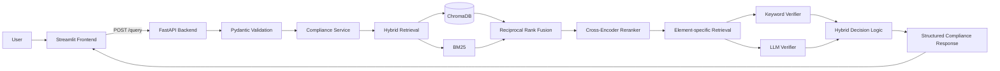

# ESG Report Compliance Checker

**Evidence-grounded ESG disclosure verification using hybrid retrieval, rule-based checks, and LLM verification**

A production-oriented NLP system that evaluates corporate ESG reports against GRI emissions disclosure requirements.

The application retrieves relevant passages from sustainability reports, evaluates individual disclosure elements as **covered**, **partial**, or **missing**, and returns structured reasoning with page-level evidence.

The system exposes a typed FastAPI backend, a decoupled Streamlit frontend, automated tests, and a Docker-based runtime.

## Key Features

- Hybrid retrieval combining ChromaDB semantic search and BM25
- Reciprocal Rank Fusion for merging retrieval results
- Multilingual cross-encoder reranking
- Element-specific queries and verification rules
- LLM-assisted compliance classification
- Three-way classification: covered, partial, and missing
- Evidence attribution with chunk IDs, excerpts, and page numbers
- Typed request and response models with Pydantic
- REST API built with FastAPI
- Streamlit frontend communicating with the backend over HTTP
- Automated API and service-layer tests with mocked dependencies
- Dockerised backend for reproducible execution
- Manual ground-truth evaluation across 11 ESG reports
- Retrieval ablation with Hit@k and Mean Reciprocal Rank

## System Architecture



### Request Flow

```text
Streamlit frontend
        │
        │ HTTP POST /query
        ▼
FastAPI backend
        │
        ├── request validation
        ├── service-layer error handling
        ├── hybrid retrieval and reranking
        ├── keyword and LLM verification
        └── structured response mapping
        ▼
Evidence-grounded compliance result
```

## Tech Stack

| Layer | Technology |
|---|---|
| API | FastAPI |
| Validation | Pydantic |
| Frontend | Streamlit |
| PDF extraction | PyMuPDF |
| Vector store | ChromaDB |
| Embeddings | OpenAI `text-embedding-3-small` |
| Keyword retrieval | BM25 using `rank-bm25` |
| Retrieval fusion | Reciprocal Rank Fusion |
| Reranking | Multilingual cross-encoder |
| LLM verification | OpenAI API |
| Testing | pytest, FastAPI TestClient, unittest mocks |
| Containerisation | Docker |
| Language | Python 3.11 |

## API

Interactive API documentation:

- Swagger UI: `http://localhost:8000/docs`
- OpenAPI schema: `http://localhost:8000/openapi.json`

### `GET /health`

Checks whether the API service is running.

```json
{
  "status": "healthy"
}
```

### `POST /query`

Runs the ESG compliance-checking pipeline.

Example request:

```json
{
  "company_id": "IBK",
  "standard": "gri_305",
  "requirement_id": "305-1",
  "verification_mode": "hybrid",
  "n_results": 25
}
```

Supported verification modes:

- `hybrid`
- `llm`
- `keyword`

Example response:

```json
{
  "company_id": "IBK",
  "requirement_id": "305-1",
  "requirement_name": "Direct (Scope 1) GHG emissions",
  "overall_status": "partial",
  "verification_mode": "hybrid",
  "element_coverage": [
    {
      "element": "Total Scope 1 emissions in tCO2e",
      "status": "covered",
      "confidence": 0.9,
      "reasoning": "A numeric Scope 1 emissions value was explicitly reported.",
      "verification_method": "hybrid-agree",
      "evidence": [
        {
          "chunk_id": "2024_KR_IBKBank_Sustainability_KO_p0064_c0001",
          "text": "Direct Scope 1 emissions were reported in tCO2eq.",
          "page_number": 64
        }
      ]
    }
  ],
  "metadata": {
    "n_results": 25,
    "element_count": 7
  }
}
```

### Error Handling

| Status | Meaning |
|---:|---|
| 200 | Compliance check completed |
| 400 | Request could not be processed |
| 404 | Company, standard, requirement, or evidence not found |
| 422 | Request validation failed |
| 503 | External dependency unavailable |
| 500 | Unexpected server error |

## Dataset

The indexed dataset contains:

- 11 corporate ESG reports
- 7,713 document chunks
- Finance, manufacturing, and infrastructure companies
- Reports from South Korea, the United Kingdom, France, and Germany
- Korean and English documents
- Manual element-level ground-truth labels based on GRI requirements

Companies include:

- IBK Bank
- Shinhan Bank
- HSBC
- Standard Chartered
- Hyundai Motor
- Samsung Electronics
- Siemens
- Schneider Electric
- KEPCO
- Incheon International Airport
- Heathrow Airport

## Evaluation Results

### Compliance Evaluation

The system was evaluated using manually constructed element-level ground truth.

| Standard | Companies | Elements | Element Accuracy | False Negative Rate | False Covered Rate | Company Accuracy |
|---|---:|---:|---:|---:|---:|---:|
| GRI 305-1 | 11 | 7 | 74.0% | 23.4% | 2.6% | 36.4% |
| GRI 305-2 | 11 | 5 | 81.8% | 14.5% | 3.6% | 72.7% |
| GRI 305-3 | 11 | 5 | 83.6% | 10.9% | 5.5% | 72.7% |

False Covered is treated as the more serious error because it incorrectly claims that a mandatory disclosure has been satisfied. The current system keeps this error comparatively low while producing more conservative false negatives.

### Retrieval Ablation

A preliminary manually verified evaluation set contains nine GRI 305-1 evidence queries across five companies.

| Retrieval Mode | Hit@5 | Hit@10 | MRR |
|---|---:|---:|---:|
| BM25 | 0.889 | 1.000 | 0.722 |
| Semantic | 0.889 | 0.889 | 0.537 |
| Hybrid RRF | 0.889 | 0.889 | 0.722 |
| Hybrid + multilingual reranker | **1.000** | **1.000** | **0.815** |

The multilingual cross-encoder reranker achieved the strongest ranking performance. Detailed methodology, error analysis, and limitations are documented in [`docs/retrieval-evaluation.md`](docs/retrieval-evaluation.md).

## Evaluation Design

### Three-Way Classification

Each disclosure element is assigned one of three labels:

- **covered**: sufficient evidence satisfies the element
- **partial**: related evidence exists, but the requirement is not fully satisfied
- **missing**: no sufficient supporting disclosure was found

This avoids forcing ambiguous or incomplete ESG disclosures into a binary decision.

### Critical Elements

Some elements correspond directly to mandatory GRI disclosure requirements. A requirement cannot receive an overall covered decision when a critical element is missing, even if non-critical elements are satisfied.

### Evidence Grounding

Every positive decision is expected to include:

- source chunk ID
- report excerpt
- PDF page number
- decision reasoning
- verification method

Missing elements return an empty evidence list.

## Quick Start

### 1. Clone the Repository

```bash
git clone https://github.com/Ayana32/esg-report-compliance-checker.git
cd esg-report-compliance-checker
```

### 2. Configure Environment Variables

```bash
cp .env.example .env
```

Add the required API key:

```env
OPENAI_API_KEY=your_openai_api_key
```

### 3. Run the FastAPI Backend Locally

```bash
python -m venv .venv
source .venv/bin/activate
python -m pip install -r requirements.txt
python -m uvicorn app.main:app --reload
```

Backend URLs:

- Health check: `http://localhost:8000/health`
- Swagger UI: `http://localhost:8000/docs`

### 4. Run with Docker

Build the backend image:

```bash
docker build -t esg-compliance-checker-api .
```

Run the container:

```bash
docker run --rm \
  -p 8000:8000 \
  --env-file .env \
  esg-compliance-checker-api
```

Verify the service:

```bash
curl http://localhost:8000/health
```

Expected result:

```json
{
  "status": "healthy"
}
```

### 5. Run the Streamlit Frontend

The FastAPI backend must be running before starting Streamlit.

```bash
source .venv/bin/activate
streamlit run streamlit_app.py
```

Open `http://localhost:8501`.

The frontend sends requests to `http://localhost:8000/query`. A different backend URL can be configured with:

```bash
export API_BASE_URL=http://your-api-host:8000
```

## Automated Tests

The test suite covers:

- API health checks
- successful compliance responses
- request validation
- invalid verification modes
- retrieval-result limits
- unknown companies
- unknown requirements
- external-service timeouts
- connection failures
- service-layer exception conversion
- mocked checker execution

Run all tests:

```bash
python -m pytest -v
```

Current result:

```text
13 passed
```

The tests mock the compliance checker where appropriate, preventing unnecessary retrieval and external LLM calls.

## Project Structure

```text
esg_compliance_checker/
├── app/
│   ├── main.py
│   ├── schemas.py
│   ├── services.py
│   ├── exceptions.py
│   ├── mappers.py
│   └── api/
│       └── routes.py
├── tests/
│   ├── test_api.py
│   └── test_services.py
├── data/
│   ├── reports/
│   ├── chunks/
│   ├── checklists/
│   └── evaluation/
├── outputs/
│   └── retrieval_ablation/
├── streamlit_app.py
├── compliance_checker_v2_hybrid.py
├── hybrid_search.py
├── retrieval_modes.py
├── reranker.py
├── evaluate_retrieval.py
├── llm_verifier.py
├── element_query_generator.py
├── ground_truth.py
├── evaluate.py
├── generate_embeddings.py
├── Dockerfile
├── pytest.ini
└── requirements.txt
```

## Known Limitations

- The retrieval evaluation currently contains only nine manually verified queries and should be treated as preliminary.
- Some companies distribute emissions methodology across multiple ESG data packs or annual reports that are not yet included in the same retrieval collection.
- Korean financial and public-sector reports use disclosure structures that differ from many European reports, contributing to retrieval gaps.
- Tables and disclosure values may span adjacent chunks.
- Presence of an IPCC or ISO reference does not always guarantee that the precise GWP version required by an element is stated.
- LLM verification can still vary for borderline or semantically ambiguous evidence.
- The current system evaluates a limited set of GRI emissions requirements.
- The current deployment is portfolio-scale and has not been tested under production traffic.

## Planned Improvements

### Evaluation

- Expand the manually verified retrieval set from 9 to at least 30 queries
- Add annotation guidelines and verification status
- Compare chunking strategies and adjacent-chunk expansion
- Measure reranker latency and candidate-pool trade-offs
- Add oracle-evidence and end-to-end compliance evaluation

### Engineering

- Add CI checks for pytest and Docker builds
- Introduce structured logging and request IDs
- Add model lazy loading and caching
- Deploy the FastAPI backend and Streamlit frontend
- Add public demo links and automated deployment checks

### Longer-Term Extensions

- Multi-document retrieval per company
- Cross-lingual report consistency analysis
- TCFD and ISSB framework support
- Cross-company comparison dashboard
- Monitoring and structured observability

## Engineering Highlights

This project demonstrates:

- end-to-end RAG application development
- hybrid information retrieval
- multilingual reranking
- evidence-grounded LLM verification
- REST API design
- typed data contracts
- frontend/backend separation
- automated testing and mocking
- Docker containerisation
- domain-specific NLP evaluation
- translation of ESG requirements into structured AI workflows

## Author

**Misun Kim**

MSc Speech and Natural Language Processing

University of Sheffield

GitHub: [Ayana32](https://github.com/Ayana32)

Built as an applied NLP portfolio project for evidence-grounded ESG disclosure verification.
