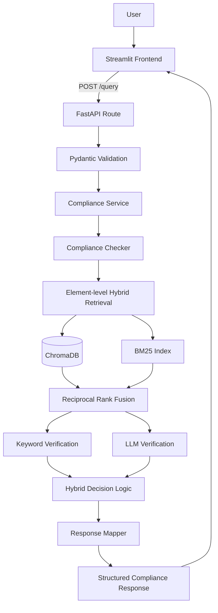

# System Architecture

## Overview

The ESG Compliance Checker is separated into a presentation layer, an API layer, an application service layer, and a retrieval and verification pipeline.



## Components

### Streamlit frontend

The Streamlit interface collects the company, requirement, retrieval size, and verification mode.

It does not initialise the retrieval pipeline directly. Instead, it sends an HTTP request to the FastAPI backend.

### FastAPI backend

The API exposes:

- `GET /health`
- `POST /query`
- Swagger UI
- OpenAPI schema

Pydantic models validate requests and ensure a stable response contract.

### Service layer

The service layer invokes the compliance checker and translates expected pipeline failures into domain-specific errors.

Examples include:

- company not found
- requirement not found
- no evidence found
- external service unavailable

### Hybrid retrieval

Relevant ESG report passages are retrieved using:

- semantic vector retrieval through ChromaDB
- BM25 keyword retrieval
- Reciprocal Rank Fusion

Retrieval is performed separately for each required disclosure element.

### Verification

Candidate evidence is evaluated using keyword rules and an LLM verifier.

Hybrid decision logic combines both signals to produce:

- `covered`
- `partial`
- `missing`

### Structured output

The response mapper converts internal pipeline results into a typed API response containing:

- company and requirement metadata
- overall status
- element-level decisions
- confidence scores
- reasoning
- verification method
- selected evidence
- PDF page numbers

## Runtime Separation

```text
Port 8501
Streamlit frontend
        │
        │ HTTP
        ▼
Port 8000
FastAPI backend
        │
        ▼
Retrieval and LLM pipeline
```

This separation allows the frontend and backend to be deployed independently.
